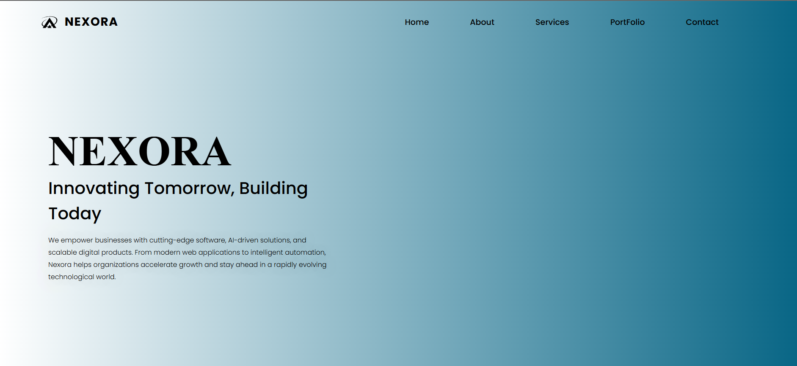
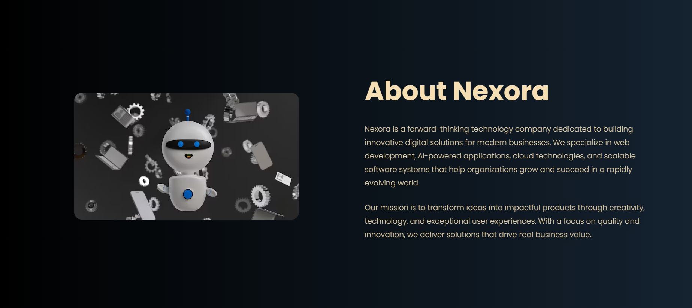
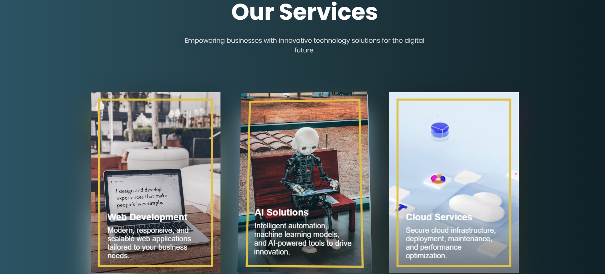
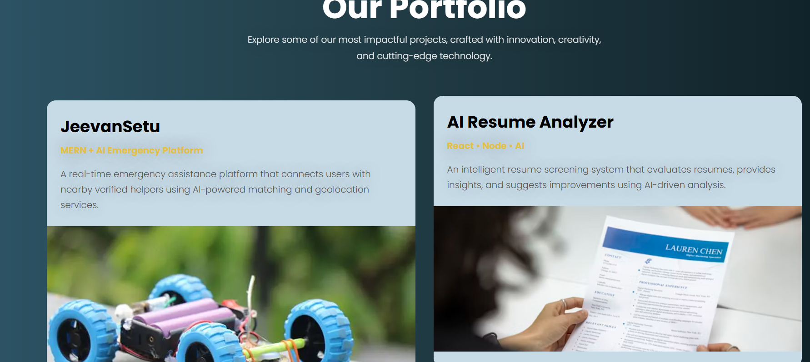
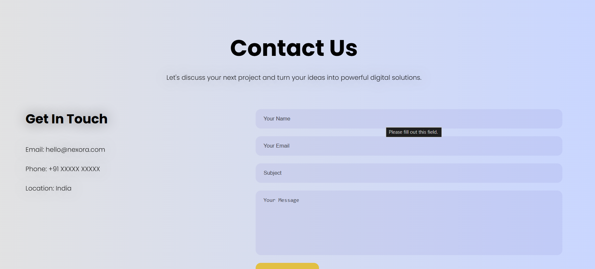

# 🌐 Nexora

Nexora is a modern and responsive business website built using React and Vite. The project focuses on delivering a professional user experience through clean UI design, responsive layouts, and optimized performance.

## 🚀 Features

* Modern and responsive UI
* Interactive Hero Section
* Professional navigation system
* Mobile-friendly design
* Fast performance powered by Vite
* Reusable React components
* Clean and scalable architecture

## 🛠️ Tech Stack

### Frontend

* React.js
* Vite
* JavaScript
* HTML5
* CSS3

## 📂 Project Structure

```text
Nexora/
│
├── first/
│   ├── src/
│   ├── public/
│   ├── package.json
│   ├── vite.config.js
│   └── ...
│
├── screenshots/
│   ├── h1.png
│   ├── h2.png
│   ├── h3.png
│   ├── h4.png
│   └── h5.png
│
├── README.md
├── LICENSE
└── .gitignore
```

## 📸 Screenshots

### Hero Section



### Landing Page



### About Section



### Responsive Layout



### Full Website Preview



## ⚙️ Installation

### Clone the Repository

```bash
git clone https://github.com/ishannndot/Nexora.git
cd Nexora
```

### Install Dependencies

```bash
cd first
npm install
```

### Run Development Server

```bash
npm run dev
```

## 🎯 Highlights

* Built with React and Vite
* Fully responsive design
* Professional business website UI
* Component-based architecture
* Optimized performance and maintainability

## 👨‍💻 Author

**Ishan Srivastava**

* B.Tech CSE (AI & ML)
* Frontend Developer
* Full Stack & AI Enthusiast

## 📄 License

This project is licensed under the MIT License.
